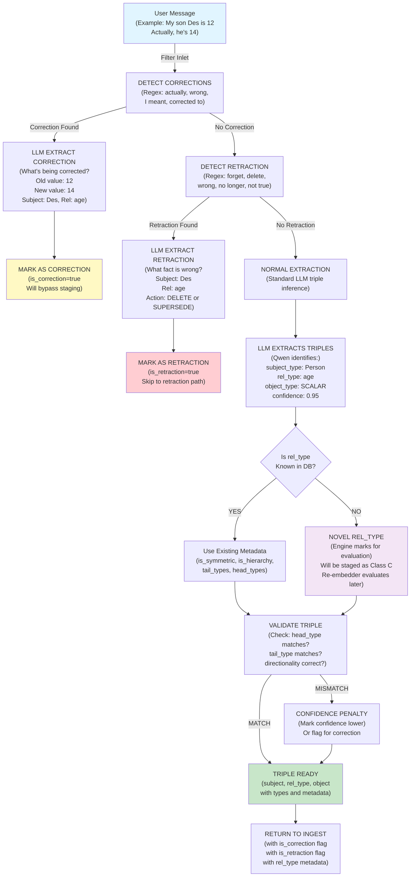
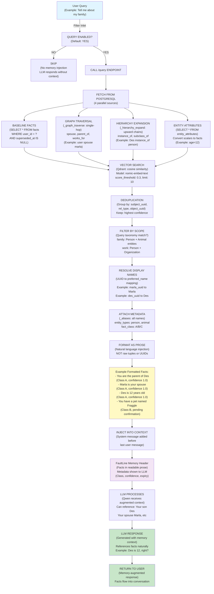

# FaultLine Pipelines: Extract, Ingest & Recall Flowcharts

Three complementary flows showing how facts enter (extract), learn (ingest), and exit (recall) the system.

---

## 1. EXTRACT PIPELINE: From Conversation to Identified Facts

**How FaultLine identifies and corrects facts from user messages.**



**Key Points:**
1. **Corrections** flagged early (bypass staging, go straight to Class A)
2. **Retractions** flagged early (skip to deletion path)
3. **Novel rel_types** marked for engine evaluation
4. **Metadata** pulled from DB or marked as unknown

---

## 2. INGEST PIPELINE: From Extracted Facts to Stored Data (With Dynamic Type Creation)

**How FaultLine learns, validates, and dynamically builds its knowledge base.**

```mermaid
graph TD
    A["Extracted Triple<br/>(subject: Des<br/>rel_type: age<br/>object: 12)"] -->|Filter Inlet| B{Retraction Signal?}
    
    B -->|YES| C["RETRACTION PATH<br/>(LLM extracted retraction)"]
    C --> D["DELETE or SUPERSEDE<br/>from facts table<br/>Mark superseded_at<br/>Archive old data"]
    D --> E["Confirmation<br/>SHORT-CIRCUIT<br/>(Skip rest of ingest)"]
    
    B -->|NO| F{Word Count >= 3<br/>or Self-ID Pattern?}
    F -->|NO| G["SKIP INGEST<br/>(will_ingest = False)<br/>Message too short"]
    F -->|YES| H["INGEST ENABLED"]
    
    H --> I{Correction?<br/>is_correction=true}
    
    I -->|YES| J["CORRECTION INGEST<br/>(User overrides LLM)<br/>Mark Class A immediately<br/>confidence = 1.0"]
    
    I -->|NO| K["NORMAL INGEST"]
    
    J --> L["WGM VALIDATION GATE"]
    K --> L
    
    L --> M["CHECK ONTOLOGY<br/>(Does rel_type exist?)<br/>(Are types known?)"]
    
    M -->|Rel_Type Unknown| N["LAYER 1: Create rel_type<br/>Engine learns new relationship<br/>Stores metadata:<br/>- category<br/>- is_symmetric<br/>- inverse_rel_type<br/>- head_types, tail_types"]
    
    M -->|Rel_Type Known| O["Use Existing rel_type<br/>metadata from DB"]
    
    N --> P["CHECK ENTITY TYPES<br/>(Do entities exist?)<br/>(Are they classified?)"]
    O --> P
    
    P -->|Type Unknown| Q["LAYER 2: Create entity_type<br/>Engine classifies entities<br/>Example: Des instance_of Person<br/>Stores via instance_of rel_type"]
    
    P -->|Type Known| R["Use Existing Types"]
    
    Q --> S["DETECT CONFLICTS<br/>(Semantic validation)<br/>Example: Can't own a Type<br/>Can't have Type as parent"]
    R --> S
    
    S -->|CONFLICT| T["AUTO-SUPERSEDE<br/>Lower confidence fact<br/>Keep user fact"]
    
    S -->|NO CONFLICT| U["VALIDATE BIDIRECTIONAL<br/>(Example: parent_of + child_of<br/>prevent both for same pair)"]
    
    T --> U
    
    U -->|VALID| V{Determine Storage Path}
    
    V -->|SCALAR<br/>age, height, name| W["LAYER 3: SCALAR PATH<br/>entity_attributes table<br/>Key: user_id, entity_id, attr<br/>Value: 12"]
    
    V -->|HIERARCHY<br/>instance_of, subclass_of| X["LAYER 3: HIERARCHY PATH<br/>facts table<br/>Defines classifications<br/>Des instance_of person"]
    
    V -->|RELATIONAL<br/>spouse, parent_of| Y["LAYER 3: RELATIONAL PATH<br/>facts table<br/>Connectivity/relationships<br/>user spouse marla"]
    
    W --> Z{Classify Confidence}
    X --> Z
    Y --> Z
    
    Z -->|User-stated<br/>confidence >= 0.95| AA["CLASS A<br/>Immediate Trust<br/>confidence: 1.0<br/>COMMIT IMMEDIATELY<br/>INSERT INTO facts<br/>(not staged)"]
    
    Z -->|LLM-inferred<br/>ontology exists<br/>no new types| AB["CLASS B<br/>Behavioral<br/>confidence: 0.8<br/>STAGE for review<br/>PROMOTE after 3 confirmations"]
    
    Z -->|Novel pattern<br/>new types created<br/>confidence < 0.6| AC["CLASS C<br/>Ephemeral<br/>confidence: 0.4<br/>STAGE for evaluation<br/>Re-embedder decides fate<br/>EXPIRE after 30 days"]
    
    AA --> AD["COMMIT FACTS<br/>(INSERT INTO facts)<br/>Example: Des, age, 12<br/>confidence: 1.0"]
    AB --> AE["STAGE FACTS<br/>(INSERT INTO staged_facts)<br/>Awaiting confirmations<br/>or re-embedder evaluation"]
    AC --> AE
    
    AD --> AF["RE-EMBEDDER SYNC<br/>(Background process)<br/>1. Embed fact text<br/>2. Sync to Qdrant<br/>3. Manage hierarchy chains<br/>4. Evaluate novel rel_types<br/>5. Promote Class B facts"]
    AE --> AF
    
    AF --> AG["COMPLETE<br/>Fact stored and indexed<br/>Ready for RECALL"]
    
    style A fill:#e1f5ff
    style E fill:#c8e6c9
    style N fill:#f3e5f5
    style Q fill:#f3e5f5
    style W fill:#fff9c4
    style X fill:#fff9c4
    style Y fill:#fff9c4
    style AA fill:#c8e6c9
    style AB fill:#ffffcc
    style AC fill:#e0e0e0
    style AG fill:#c8e6c9
```



**Three-Layer Learning Process:**

| Layer | What | Where | Purpose |
|-------|------|-------|---------|
| **Layer 1** | Rel_types | rel_types table | Learn new relationships |
| **Layer 2** | Entity types | facts table (instance_of) | Learn new classifications |
| **Layer 3** | Facts | scalar/relational/hierarchy paths | Learn specific data points |

**Three Confidence Classes:**
- **A**: Immediate (user-stated, bypasses staging)
- **B**: Behavioral (LLM-inferred, needs 3 confirmations)
- **C**: Ephemeral (novel patterns, evaluated by engine)

---

## 3. RECALL PIPELINE: From User Query to LLM-Ready Facts

**How FaultLine retrieves and injects facts into the LLM context.**



**Four Retrieval Sources:**
1. **Baseline Facts** — Identity-anchored facts (spouse, parent_of, age)
2. **Graph Traversal** — Single-hop connectivity (who am I connected to)
3. **Hierarchy Expansion** — Classification chains (what am I)
4. **Attributes** — Scalar facts converted to relationships (age, height)

**Dedup & Format:**
- Deduplicate by UUID triple (prevents alias multiplication)
- Attach metadata (_aliases, entity_types, fact_class)
- **Format as natural language prose** (not raw UUIDs or rel_types)
- Inject into LLM context with Class/confidence metadata

---

## Key Principles Illustrated

### EXTRACT
- **Corrections & Retractions:** Detected early via regex and LLM
- **Rel_type Handling:** Novel types marked for engine evaluation
- **Metadata:** Pulled from DB or flagged as unknown
- **Validation:** Head/tail type constraints checked

### INGEST
- **Three-layer learning:** Rel_types → Entity types → Facts
- **Three storage paths:** SCALAR | HIERARCHY | RELATIONAL
- **Three confidence classes:** A (immediate) | B (staged→promoted) | C (ephemeral)
- **Validation first:** WGM gate enforces ontology before storage
- **Dynamic creation:** Engine learns new types, stores metadata
- **Background sync:** Re-embedder handles async Qdrant updates

### RECALL
- **Four retrieval sources:** Facts + Graph + Hierarchy + Attributes
- **UUID-based dedup:** Prevents alias variations from creating duplicates
- **Prose injection:** LLM sees "Marla is your spouse", not "uuid1→spouse→uuid2"
- **Metadata transparency:** Class/confidence shown to LLM (allows reasoning about certainty)

---

## Example: Full Lifecycle with Dynamic Type Creation

**User says:** "My son Des is 12"

### EXTRACT
1. No correction or retraction detected
2. LLM extracts: `{subject: Des, rel: age, object: 12, subject_type: Person}`
3. Checks DB: age rel_type exists, SCALAR tail_types
4. Returns triple with metadata

### INGEST
1. Message length check: ✅ Pass
2. Not a correction: ✅ Normal ingest path
3. WGM gate checks: age rel_type exists ✅
4. No entity type for Des: Creates Des instance_of Person (Class A) → **LAYER 2**
5. Routes to SCALAR path
6. Confidence = 1.0 (user-stated) → **CLASS A**
7. Commits: (user, Des, age, 12) to entity_attributes
8. Re-embedder syncs to Qdrant

### RECALL
1. User asks: "How old is Des?"
2. Retrieves baseline facts: finds Des entity
3. Graph traversal: Des connected to user via parent_of
4. Attributes: finds entity_attributes row (Des, age, 12)
5. Dedup: consolidates to one fact
6. Formats as prose: "Des is 12 years old (Class A, confidence 1.0)"
7. Injects into LLM context
8. LLM responds: "Des is 12 years old, right?"

**The full cycle: EXTRACT → INGEST (learn) → STORE → RECALL → OUTPUT** ✨

---

## Dynamic Type Creation: Under the Hood

When the engine encounters unknown types:

```
User Input
    ↓
Extract finds: age rel_type (unknown)
    ↓ [LAYER 1]
Engine creates: rel_type="age", category="person_attributes", tail_types={SCALAR}
    ↓
Stored in rel_types table → available for future facts
    ↓
Extract finds: Des instance_of ??? (type unknown)
    ↓ [LAYER 2]
Engine creates: instance_of rel_type, Des as Person entity
    ↓
Stored as hierarchy fact → shapes future recalls
    ↓
Now fact goes to correct storage path [LAYER 3]
    ↓
Result: System learned new relationship type → smarter routing → better storage
```

This is why **no hardcoding is needed** — the engine learns and adapts.
